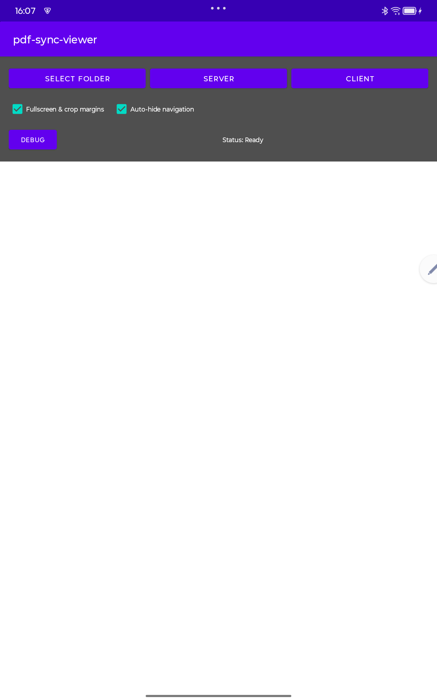
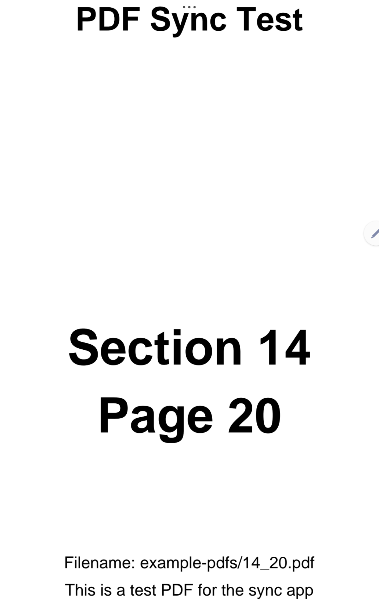
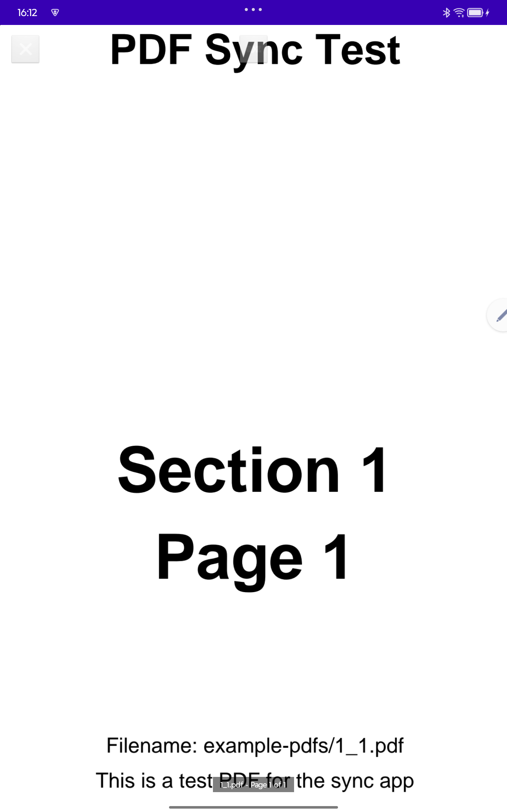
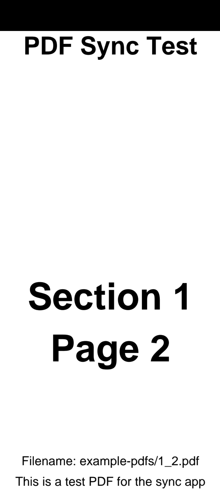

# PDF Sync Viewer

This project enables synchronized PDF/JPG sheet viewing between Android devices using BLE broadcasts, with optional RTP MIDI (AppleMIDI) control of the server.

## 🚀 Quick Start

### Installation
1. Download the latest APK from [Releases](../../releases) - or grab the
   newest development build from the
   [nightly pre-release](../../releases/tag/nightly) (updated on every
   push to main, no GitHub login needed)
2. Install on your Android devices
3. Grant Bluetooth and storage permissions when prompted

### Usage
Copy the PDF/JPG files onto every device **before** starting the app -
syncing the folder itself is out of scope, use a tool like Dropbox,
Syncthing or a USB cable for that.

Files are matched by name, so every musician can have their own
instrument's version of the sheets: keep a common root with one subfolder
per instrument (same file names in each), and on each tablet select the
subfolder for that musician's instrument.

1. **Server Device (Presenter)**:
   - Tap "Select Folder" to choose the folder with your PDF/JPG files
   - Tap "Server" to begin broadcasting
   - Navigate through pages and files - changes are broadcast to clients.
     Tap the center of the page (or the list button) to pick a file from
     the folder, tap the left/right thirds to turn pages

2. **Client Device (Viewer)**:
   - Select a folder containing the same files (or choose the "Numbers"
     type to act as a pure number display)
   - Tap "Client" to listen for broadcasts - file and page changes are
     followed automatically

## 📸 Screenshots

| Setup | Reading (fullscreen crop) | Reading controls |
|---|---|---|
|  |  |  |

| Client following the server | Number display (no files needed) |
|---|---|
|  |  |

## 📱 Features

- **Real-time File Sync**: which file (and page) is currently open is
  broadcast via BLE - clients follow by opening their local copy. Only
  this selection is synchronized, the files themselves are never
  transferred: distributing the folder to all devices is out of scope of
  the app. Use a sync tool such as Dropbox, Syncthing or a USB cable, and
  make sure the files exist on each device before the app is started
- **RTP MIDI Control**: Control the Server's page navigation using network MIDI (AppleMIDI/RTP MIDI)
- **Dual Mode**: Server (broadcaster) and Client (receiver) modes
- **No Internet Required**: Direct device-to-device communication
- **PDF Viewer**: Built-in PDF viewing with navigation controls
- **Music-Stand Friendly**: tap zones for page turns (center tap opens the
  file list), Bluetooth pedal support (volume/arrow keys), auto-hiding
  controls, automatic margin cropping, screen stays on
- **Number Display Mode**: devices without the sheet files show the received
  section/sheet number fullscreen (e.g. "3/15"), readable from a distance.
  Selecting the "Numbers" file type makes this explicit - no files are
  loaded at all
- **JPG Support**: display images instead of PDFs (same naming scheme,
  selectable file type in settings), selected folder is remembered
- **Group Code**: an optional shared code (settings) isolates your group -
  clients only accept broadcasts carrying the matching tag, so strangers or a
  second band in the same venue cannot confuse them. The RTP MIDI session name
  gets the code as suffix (e.g. "pdf-sync-viewer-bandA"). Note: this prevents
  accidental interference, it is not cryptographic authentication.
- **Easy Setup**: Simple one-tap server/client switching

## 🛠️ Development

### Build Android App
```bash
cd android-app
./gradlew assembleDebug
```

## 🔧 Technical Details

- **Android**: Kotlin, BLE Peripheral/Central modes (advertiser/scanner)
- **PDF Viewer**: Android's built-in `PdfRenderer`
- **Communication**: connectionless - the current file name and page are
  embedded in the BLE advertisement, clients only scan; plus RTP MIDI
  (session name: "pdf-sync-viewer")
- **MIDI Mapping**: Bank Select + Program Change select the PDF by filename, using the 1-based numbers as displayed in common song-list/setlist apps (bank 14 + program 20 opens `14_20.pdf`). Note On turns to the absolute page within the current PDF (Note 5 = Page 5).
- **Range**: ~10-30 meters (typical BLE range), or local Network for MIDI

## 📋 Requirements

### Android
- Android 5.0+ (API 21+)
- Bluetooth LE support
- Storage permission (for PDF file access)
- Location permission (required for BLE advertising/scanning)

## 🚀 CI/CD

This project includes automated workflows:
- **Android APK Build**: Automatic APK generation on releases
- **Release Management**: Tagged releases with downloadable APKs
- **Multi-Device BLE Tests**: on every push, two emulators with virtual
  Bluetooth run the real server/client sync against each other - see
  [multi-device-tests/](multi-device-tests/) (the same suite runs on
  physical devices via `multi-device-tests/run_tests.sh`)

## 🤝 Contributing

1. Fork the repository
2. Create a feature branch
3. Make your changes
4. Submit a pull request

## 📄 License

GPL-3.0 - see [LICENSE](LICENSE) for details.

The RTP MIDI support is based on a modified copy of
[DPMIDI](https://github.com/DisappointedPig/DPMIDI) (GPL-3.0), see
[android-app/midi/NOTICE.md](android-app/midi/NOTICE.md).

## 🐛 Troubleshooting

### Common Issues
- **"No PDF loaded"**: Select a folder first before starting server/client
- **"Client not following"**: Check Bluetooth is enabled on both devices and
  that both use the same group code
- **"Permission denied"**: Grant Bluetooth and storage permissions
- **"Server not found"**: Ensure server device is broadcasting

### Debug Tips
- Check that both devices have the same PDF file
- Ensure devices are within BLE range (~10-30m)
- For RTP MIDI: Ensure the Android device and MIDI controller are on the same Wi-Fi network.
- Restart the app if connection issues persist
- Use Android Studio logcat for detailed debugging

### Testing RTP MIDI
`test_midi.py` (repo root, no dependencies beyond Python 3) emulates an
RTP MIDI controller app: it performs the full AppleMIDI handshake, answers
clock sync, and sends bank select + program change the way setlist apps do
on song selection.

```bash
# Jump to page 42 on the device at 192.168.1.100 (app must be in server mode)
python3 test_midi.py 192.168.1.100 42

python3 test_midi.py 192.168.1.100 42 --simple   # bare program change
python3 test_midi.py 192.168.1.100 42 --note     # note on instead
```

If you are on macOS, you can also use **Audio MIDI Setup** -> **MIDI Studio**
-> **Network** to connect to the "pdf-sync-viewer" session.

## 📖 How It Works

1. **Server Mode**: the device embeds the current file name and page in its BLE advertisement
2. **Client Mode**: the device scans for these advertisements - no connection or pairing is involved
3. **Synchronization**: when the server opens another file or page, clients open their local copy of the same file (or show its number in Numbers mode)
4. **File Loading**: each device renders its own copy of the files - the app never transfers file contents. Distribute the folder to all devices beforehand (Dropbox, Syncthing, USB, ...); the files must exist before the app is started
